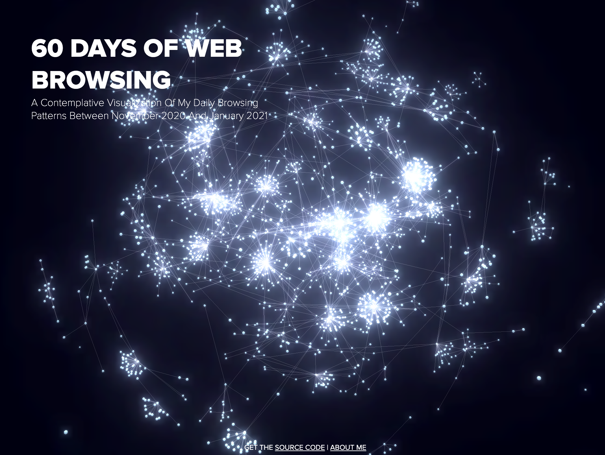

# 60 days of browsing
This project aims to visualize the web browsing patterns during 60 days of my life. 

Public site: https://60days.vercel.app/

### Development
The data used has been extracted from the Chrome's user history database (SQLite). 

In the `data` folder you can find the SQL code used to join tables and parse the fields to enrich data. The resulting table has been exported to csv which has been then processed in R to obtain a graph structure based on daily browsing flows. R code is also available in the `data` folder.

The rendering of the graph makes use of the library `3d-force-graph` by [vasturiano](https://github.com/vasturiano/3d-force-graph) which makes use of d3.js force simulations and three.js. 

